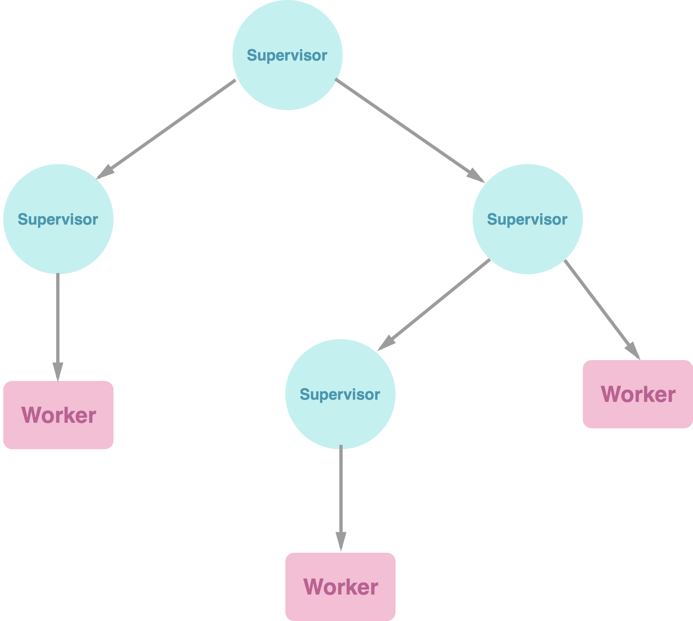

#Erlang
> 
Erlang (/ˈɜrlæŋ/ er-lang) is a general-purpose concurrent, garbage-collected programming language and runtime system.
-- Wikipedia


#**Learning Erlang**

---

##Poohdish Rattanavijai
 **+RobGThai**
# [fit] Android Developer & I code whatever interesting get thrown my way


---

#Erlang specific naming requirement
- File name must match name of the module.
- Variable start with capital letter. 
- Atom start with lower-case character.
- Each variable is immutable, meaning it can only be defined once.
- Execution must end with '**.**'

---

#Variable

'=' symbol bind data to variable regardless of what's on which side.

```erlang
Number = 5              % Integer
Double = 10.0           % Double
Word = "Hello"          % Character list
List  = [1, 1, "Word"]  % List
Tuple =  {a,b,c}        % Tuple
_Foo = "foo"            % Prefix variable with _ tell compiler 
                        % that we don't intend to use it.
```

---

#Never assign variable twice.

Because it is **not possible**.

```erlang
Number = 5.
5
Number = 6.
** exception error: no match of right hand side value 6
```

---

#List specific function

```erlang
[H|T] = list    %list  = [1, 1, "Word"]  
H.              % [1] % Head (First position)  
T.              %[1, "Word"] % Tail (The rest of the list)  
[J,Y] = list    % Still works.  
[J,Y|Z] = list  % Still works.  
```

---

#How to compile Erlang code?

- In Terminal  
**erlc exercise1.erl**

- In Shell  
**c(exercise1).**  

*Remember the dot '.', I'm dead serious.*

---

#Executing compiled Erlang code
- Without shell (Each -s is one statement, in this case execute then quit.) 
**erl - noshell -s exercise1 helloIO -s erlang halt**
- With shell  
**erl**  
~ **exercise:hello().** 

--- 

#Finding out what is in the module
~ **exercise:module_info().**

```erlang
[{exports,[{server,1},
           {client,1},
           {module_info,0},
           {module_info,1}]},
 {imports,[]},
 {attributes,[{vsn,[36814911418961652134185126725259582172]}]},
 {compile,[{options,[]},
           {version,"4.9.4"},
           {time,{2014,4,19,9,6,47}},
           {source,"/Users/RobGThai/Code/erlang/message.erl"}]}]
```

---

#Module structure

```erlang
-module(module_name).   % Module name

-export([
        function1/0,    % declaring public function name.
        functionWithTwoPattern/2]).

function() -> "This is a method". %function implementation.
functionWithTwoPattern(Fname, Lname) -> 
    io:format("Your name is ~s ~s", Fname, Lname).
```

---

#Function overload using pattern matching

```erlang
factorial(0) -> 1;  % If 0 was given
factorial(1) -> 1;  % If 1 was given
factorial(N) when N > 1 -> N * factorial(N-1). 
% If anything more than 1 is given.
```

Notice **when N > 1** in the last function. This is called **Guard**, it is a scope for acceptable argument.

---

#Function overload with multiple arguments

```erlang
-export([foo/0, foo/1, foo/2]).     
% Number of argument in the function must match the /X declaration.

foo() -> <...> .
foo(L) -> <...> .
foo(L, C) -> <...> .

```

---

#Recursive function 

Remember, there's **no iteration** in Erlang.

```erlang
factorial(N) when N > 1 -> N * factorial(N-1).
```

Just like you normally would.
By the way, you probably notice by now that each function is start and end with **```->``` and ```.```**

---

#Multiple lines function

When a function does several thing, each statement before the last must be ending with ```','``` 

```erlang
hello(joe) ->
    io:format("Hello Joe.~n"),
    io:format("How are you?~n").
```

---

#If expression

Similar to a function but notice the ```';'``` at the end of the last line for each condition and the absent of it from the last condition.

```erlang
if L =/= [] ->      % If L is not empty
    sum(L) / count(L);
true ->
    error           % Force error
end.
```

The If condition 'L =/= []' is also a **Guard**. As there is not Else in Erlang, we can add true as the last Guard to support it.

---

#Case expression
Case use pattern to match the given tuple with the defined one. You can also add a guard as well.

```erlang
    case Message of
        {average, L} -> average(L);
        {sum, L} when L =:= [] -> 0;    % Only when L is empty
        {sum, L} -> sum(L);
    end.
```

---

#Buildin function

```erlang
erlang:hd       % Head
erlang:tl       % Tail
erlang:length   % Count number of item in the list
lists:sum       % Summation of all the item in the list

list:foldl      % Fold left
list:foldr      % Fold right
```

There are plenty of things available. You can use ```module_info()``` function to get list of the available functions.

---
#Basic functional

```erlang
% '<-'                  % This is called list comprehensive
% [<do> || <for each> || <only if>]
% For each X in [1,2,3], multiply X by 2.
[X*2 || X <- [1,2,3]]                   % [2, 4, 6]
% For each X in [1,2,3], if X > 2, multiply X by 2.
[X*2 || X <- [1,2,3], X > 2]            % [6]
% Using closure(annonumous function)
lists:filter(fun(X) -> (X rem 2) =:= 0 end, [1,2,3,4])      % [2, 4]
[X+Y || X <- [1,2,3], Y <- [4,5,6]]     % [5, 6, 7, 6, 7, 8, 7, 8, 9]
```

---

#Process & Thread
```erlang
% Run on main thread
process_loop() ->           % Run thread
    receive                 % Wait for input
        Message ->          % input
        io:format("~s~n", [Message]),          % ~s is '%s'
        process_loop()      % Keep thread alive
    end.

%Module, Function, Argument
p = spawn(M, F, A)     % Start a new thread
% Register the process_loop thread with p1
register(p1, spawn(exercise1, process_loop, [])).
% Unregister p1
unregister(p1).
```

In Erlang, everything can be convert into process using spawn. Hence concurrency is very easy.

---

#Threading
The ```receive``` Wait for input and if match proceed accordingly.

```erlang
list_process(List) ->
    receive
        {put, Val} ->                 % put Val onto List
            NewList = [Val|List],
            list_process(NewList);

        print ->                      % print everything in the List
            io:format("~p~n",[List]),
            list_process(List);

        {Caller, pop} ->              % pop top of the List to the given Caller
            [Val | NewList] = List,
            Caller ! Val,             % Talk back to Caller
            list_process(NewList)
    end.
```

---

#Monitoring
You can monitor the processes usage using Erlang build in function.

```erlang
% Display Monitor
appmon:start().

% Display processes
erlang:processes().
```

You can also use ```htop``` via terminal to access your memory usage information.

---

#Process Link

Erlang can link multiple processes together. If one of the linked process die unexpectedly, all linked processes will die together as well.

```erlang
loop() ->
    receive
        {link, PID} -> 
            link(PID),      % Link this process with the given Process ID
            loop();
        die ->
            exit("DIE")     % Force this process to die
    end.
```

---

#Process Link (Cont.)

```erlang
loop2() ->
    process_flag(trap_exit, true),  % Convert incoming Exit signal to message.
    receive
        {link, PID} -> 
            link(PID),
            loop2();
        die ->
            exit("DIE");
        ExitMessage ->              % The message above used here
            io:format("~p~n", [ExitMessage]),
            loop2()
    end.
```

---

#OTP Design Principle



---

#Behaviors

1. gen_server
2. gen_fsm
3. gen_event
4. supervisor

---

#gen_server 

**Start server**

```erlang
% Start current module as a callback for genserver.
gen_server:start_link({local, ?SERVER}, ?MODULE, [], []).
% start_link( {<scope>, <module_name>}, <module_callback>
%    , <init argument>, <options>)

% Send message to server via gen_server
gen_server:call(genserver, hello).
% In turn, gen_server pass the Request to run on genserver 
% trickering callback on genserver.
```

---

#State tuple, a.k.a Hash

```erlang
Request1 = #state{name = "Poohdish", age = 30}. % Create hash
Request2 = Record1#state{age = 22}. % Update age but keep name
Name = Record1#state.name.  % Access name
```

---

#Record (Smarter State)

```erlang
% record.hrl file contain state definition.
-record(people, {
    name = "",
    age
    }).

% Read record into shell.
> rr("record.htl"). 

% Remove record from shell.
> rf().

% Assign People1 to People State
People1 = #people{}.

% Assign People1 to People State
People1 = #people{}.
% Update value in People1 and give it t People2
People2 = People1#people{name = "Gof", age = 30}.

```

---

#Rebar 
> Erlang build tool that makes it easy to compile and test Erlang applications, port drivers and releases.
-- https://github.com/rebar/rebar

---

#Rebar: Generating structure

Source code will be under **/src**

```
>rebar create-app appid=list_app
```

---

#Rebar: Configure supervisor

```erlang
init([]) ->
    {ok, { {one_for_one, 5, 10}, [
            {               % This is child specs
                list_server,
                {list_server, start_link, []},
                permanent,
                brutal_kill,
                worker,
                [list_server]
            }
        ]} }.
```
---

#Rebar: Compiling application

Complied code will be under **/ebin**

```
>rebar compile
```

---

#Running compiled app

_Loading app into Erlang_  

```
>erl -pa ./ebin
```

_Start application_

```erlang
application:start(list_app)
```

_Updating code_

```erlang
code:load_file(list_app).
```

---

#Release app

**mkdir rel** in the same directory as src.

```
› rebar create-node nodeid=list_app
```

In a newly create **reltool.config** add **{lib_dir, ".."}** to the last argument for **sys**. It should look similar to this:

```erlang
{app, list_app, [{mod_cond, app}, {incl_cond, include}, {lib_dir, ".."}]}
```


---

#Package Erlang

Create **rebar.config** in root directory.

Add **{sub_dirs, ["rel"]}.** inside the file.

```
> rebar generate
```

File will be package under **/rel/list_app/bin** directory.

Start the app using **./list_app** inside **/bin** 

---

#Other reading
- cowboy
- basic-erlang-socket
- Bit syntax
- L 99, Ninety-Nine Lisp Problems
- ```http://www.erlang.org/doc/design_principles/des_princ.html```

---

#Thank you

Feedback & Question

**thisisrobg@gmail.com**


